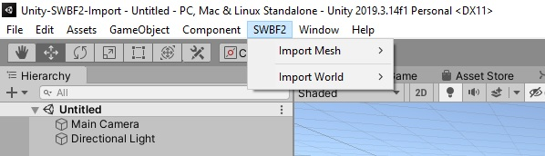

# Unity SWBF2 Import

Import Maps from the Star Wars Battlefront II (2005) Mod Tools into Unity.<br />
This Importer is currently based on the [LibSWBF2-CSharp](https://github.com/Ben1138/LibSWBF2-CSharp) Library.
<br /><br />


<br /><br /><br />
What's supported:
- World ```*.wld``` Files
- Layer ```*.lyr``` Files
- Mesh ```*.msh``` Files (with Materials)
- Terrain ```*.ter Files``` (without Textures, so far just height information)

# How to install
1. Simply put the ```SWBF2Import``` folder into your ```Assets/``` directory
2. You should see a ```SWBF2``` Menu Entry on the top:
<br /><br />

<br /><br />

# How to use
1. Click on ```SWBF2 --> Import World --> Import *.wld```. This should open two windows: One for importing the world and one for adjusting options for mesh import.
2. Click on ```Open *.wld File``` to browse for a world File (e.g. BF2_ModTools/assets/worlds/GEO/world1/geo1.wld)
3. Optional: Specify alternate msh directorys to search for (additional to the local world msh directory). This e.g. applies for health droids, command posts, etc.
4. Select if you wish to import the Terrain
5. Select the Layers you wish to import (The number in parentheses indicates the amount of objects that layer contains)
6. Hit ```Import```. This may take a while, so be patient (even if it seems unity froze)
<br /><br />

